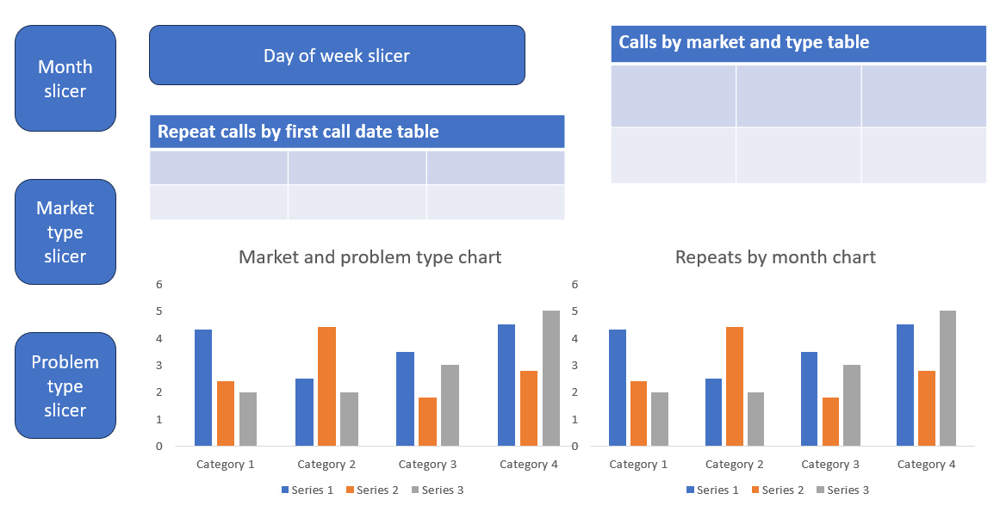

# Google Fibre

## Background

Google Fibre provides individuals and businesses with fibre optic internet. As part of their interview process, the Fibre customer service team has requested that I design a dashboard using fictional data. 

The team needs to understand how often customers phone customer support again after their first enquiry. Further, leaders want to explore the trends in repeated calls to understand why customers are calling more than once, as well as to improve the overall customer experience. The insights provided by the dashboard will inform the team's next steps. 

The information provided was 3 seperate spreadsheets for market 1, 2 and 3. The spreadsheets were combined on Bigquery using a union (SQL). Only information for January, February and March 2022 was provided. 

## Stakeholder Requirements Document
                                                                                        
**BI Professional:** Thandie R. 

**Client/Sponsor:** Google Fibre. Emma Santiago (Hiring manager).

**Business problem:** To determine how often customers call back after the first inquiry. To explore the trend in repeated calls to identify why customers have to call more than once and to explore how to improve the overall customer experience. 

**Stakeholders:**
-Emma Santiago (Hiring manager)
-Keith Portone (Project manager)
-Minna Rah (Lead BI Analyst)
-Ian Ortega, BI Analyst
-Sylvie Essa, BI Analyst

**Stakeholder usage details:** Stakeholders would like to understand how often customers are calling in different markets with different problems. Insights will improve customer service and customer satisfaction. 

**Primary requirements:**
-A chart or table measuring repeat calls by their first contact date
-A chart or table exploring repeat calls by market and problem type
-Charts showcasing repeat calls by week, month, and quarter
-Provide insights into the types of customer issues that seem to generate more repeat calls
-Explore repeat caller trends in the three different market cities
-Design charts so that stakeholders can view trends by week, month, quarter, and year

## Project Requirements Document
                                                                                        
**BI Analyst:** Thandie R.

**Client/Sponsor:** Google Fibre; Emma Santiage, Hiring Manager

**Purpose:** As part of an interview process, Fibre customer service team has requested a dashboard using fictional call center data. Google Fibre provides individuals and businesses with fibre optic internet. The customer service team would like to determine how often customers call again after the first inquiry. They would like to explore the trends in repeated calls to identify why customers are having to call more than once. Insights will improve the overall customer service experience. The dashboard created should provide valuable insights to the customer service team. 

**Key dependencies:**

*Team members:* 
-Ian ortega (BI Analysts)
-Sylvie Essa (BI Analysts)

*Stakeholders:* 
-Emma Santiago, Hiring Manager (primary contact)
-Keith Portone, Project Manager (primary contact)
-Minna Rah, Lead BI Analyst

*Expected deliverables:*
-A chart or table measuring repeat calls by their first contact date
-A chart or table exploring repeat calls by market and problem type
-Charts showcasing repeat calls by week, month, and quarter

**Stakeholder requirements:** (R - required, D - desired, or N - nice to have.)
-R: A chart or table measuring repeat calls by their first contact date
-R: A chart or table exploring repeat calls by market and problem type
-D: Charts showcasing repeat calls by week, month, and quarter
-R: Dashboard needs to be accessible, with large print and text-to-speech alternatives.
-D: Provide insights into the types of customer issues that seem to generate more repeat calls
-R: Explore repeat caller trends in the three different market cities
-R: Design charts so that stakeholders can view trends by week, month, quarter, and year. 

**Success criteria:** 
The team’s ultimate goal is to reduce call volume by increasing customer satisfaction and improving operational optimization. The dashboard should demonstrate an understanding of this goal and provide stakeholders with insights about repeat caller volumes in different markets and the types of problems they represent. 

*Specific:* The insights provided by the dashboard should identify the characteristics of repeated calls and the quantity of such calls.

*Measurable:* Calls are to be evaluated using quantifiable metrics such as frequency and volume.

*Action-oriented:* The dashboard should provide insights that the team can use to reduce call volume and increase customer satisfaction

*Relevant:* All metrics and dimensions used should be relevant to Google Fibre and support the primary goal. 

*Time-bound:* Analyse data that spans at least one year to understand how repeat callers change over time.

**User journeys:** 
-Current user experience: Customers call more than once before their inquiry is resolved.
-Ideal future experience: Reduced repeated calls, and improved customer experience.

**Assumptions:**
To anonymize and fictionalize the data, the datasets the columns market_1, market_2, and market_3 to indicate three different city service areas the data represents. 
The data also lists five problem types:
-Type_1 is account management
-Type_2 is technician troubleshooting
-Type_3 is scheduling
-Type_4 is construction
-Type_5 is internet and wifi

Additionally, the dataset also records repeat calls over seven day periods. The initial contact date is listed as contacts_n. The other call columns are then contacts_n_number of days since first call. For example, contacts_n_6 indicates six days since first contact.

**Compliance and privacy:** The datasets are fictional and anonymized. Therefore, there are no apparent privacy concerns.
 
**Accessibility:** Per Minna’s request, the dashboard needs to be accessible, with large print and text-to-speech alternatives.

**Roll-out plan:** 
I expect to be done with the project in three weeks.
*Week one:* Planning and follow up questions with Google Fibre
Week two: Finalize SQL. Dashboard design. First review with the team.  
Week three: Dashboard building and testing.

## Strategy Document

**Sign off matrix**

| Name | Team/Role | Date  |
|-----------|------------|-------------|
| Thandie R | BI Analyst | 12/02/2024  |

**Proposer:** Emma Santiago (Hiring manager)

**Status:** [Draft] > *Under review* > Implemented | Not implemented (Highlight current status)

**Primary dataset:** 
1market_1 
2market_2 
3market_3

**Secondary dataset:** N/A

*User Profiles*

-Emma Santiage, Hiring Manager
-Keith Portone, Project Manager
-Minna Rah, Lead BI Analyst
-Ian Ortega, BI Analyst
-Sylvie Essa, BI Analyst

**Dashboard functionality**

*Reference dashboard*
Build a new dashboard to explore the number of repeat callers in three different market cities, including their problem types.

*Access*
Read only access will be provided to the individuals listed under user profiles. 

*Scope*
Fields include date, market, problem type, contact_n and contact_n#

*Date filters and granularity*
Data filters can be applied for market, problem type, day and month

Granularity:
Any chart with detailed metrics should have the ability to click on that metric to view specific information.

**Metrics and charts**

*Chart 1*
| Chart feature| Request      |
|--------------|--------------|
| Chart title  | Repeat calls by first contact date   |
| Chart type  | Table   |
| Dimension(s)  | First contact date, subsequent repeat calls |
| Metric(s)  | Contact   |

*Chart 2*
| Chart feature| Request      |
|--------------|--------------|
| Chart title  | Repeat calls by market and problem type   |
| Chart type  | Column chart   |
| Dimension(s)  | Market, problem type, contact_n, contact_# |
| Metric(s)  | Contact   |

*Chart 3*
| Chart feature| Request      |
|--------------|--------------|
| Chart title  | Repeat calls by market and problem type |
| Chart type  | Table   |
| Dimension(s)  | Market, problem type |
| Metric(s)  | Contact   |

*Chart 4*
| Chart feature| Request      |
|--------------|--------------|
| Chart title  | Repeat calls by month |
| Chart type  | Column chart   |
| Dimension(s)  | Date, contact |
| Metric(s)  | Date  |

*Dashboard Mockup*

## Conclusion

*Insights*

Based on the insights provided, it was determined that the most common problem (resulting in 46% of repeat calls) is internet and wifi (type 5), followed by technical troubleshooting (type 2) at 43%. These two were the main problem types accounting for over 80% of repeat calls in January, February and March 2022. For all three months, each of these problems accounted for about 40% of repeat calls.

The dashboard further reveals that in Market 1, 2 and 3, internet and wifi (type 5) was the cause for 38%, 35% and 71% of the total repeat calls respectively. On the contrary, it is evident that in Market 1, 2 and 3, technical troubleshooting (type 2) was the cause of 52%, 45% and 16% of the total repeat calls respectively.

The days with highest repeat calls were Monday, Wednesday and Tuesday. 

*Recommendations*
1. Ensure experienced and fully trained staff is on duty from Monday to Wednesday.
2. Allocate all calls related to internet and wifi as well as technical troubleshooting to experienced and fully trained staff.
3. Request customer feedback after all repeat calls, providing more details on how the problem could have been resolved better. 
